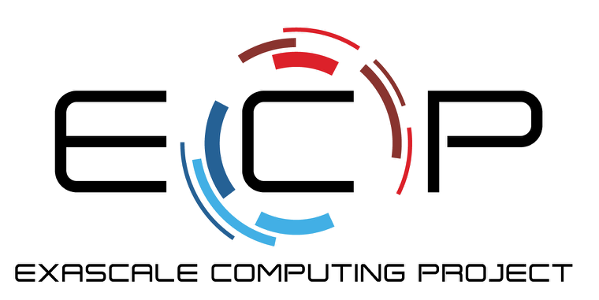

ENRICO: Exascale Nuclear Reactor Investigative COde
===================================================

ENRICO is an application that automates the workflow for solving a coupled
particle transport, heat transfer, and fluid dynamics problem. Currently
supported solvers include the `OpenMC <https://docs.openmc.org>`_ and Shift
Monte Carlo codes, the `Nek5000 <https://nek5000.mcs.anl.gov>`_ and `nekRS
<https://github.com/Nek5000/nekRS>`_ computational
fluid dynamics codes, and a subchannel/heat diffusion surrogate solver.

The code establishes a mapping between the geometry representation in the Monte
Carlo transport solver and the spectral element mesh used by Nek5000 so that the
output of each code can be used as the input of the other. Heat generation rates
determined by the transport solver are used as heat sources in the CFD
simulation, and the temperature/density fields from the CFD simulation are used
as inputs for the transport solve.

Documentation
-------------

.. toctree::
   :maxdepth: 2

   userguide/index
   devguide/index
   methodology/index
   license

Acknowledgment
--------------

Development of ENRICO was supported by the Exascale Computing Project
(17-SC-20-SC), a joint project of the U.S. Department of Energy’s Office of
Science and National Nuclear Security Administration, responsible for delivering
a capable exascale ecosystem, including software, applications, and hardware
technology, to support the nation’s exascale computing imperative.

