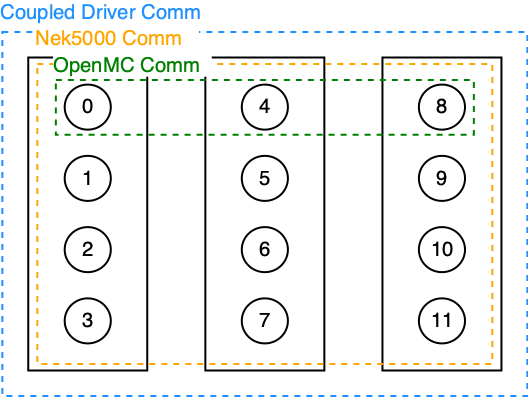

Methodology
===========

MPI Communicators for Coupling Nek5000 and OpenMC
-------------------------------------------------

The coupled Nek5000/OpenMC driver must account for the fact that the two single physics codes have
different parallelization schemes:

* Since OpenMC is a hybrid MPI/OpenMP code, its performance is best when each node is assigned 1
  or 2 MPI ranks and sufficient OpenMP threads to occupy all CPU cores [Romano2015]_.
* Since Nek5000 is a pure MPI code, its performance is best when each node is assigned sufficient
  MPI threads to occupy all CPU cores.

To handle this, ENRICO creates the MPI communicators shown in :numref:`openmc-nek-comms`.  Black
rectangles represent a physical node [#f1]_, and black circles represent MPI ranks.  Numbers
represent MPI rank IDs; for our implementation, the actual numbering can be arbitrary.

* The OpenMC communicator (in green) encompasses 1 rank in every node, by default.  An alternate
  number of ranks per node can be specified.
* The Nek5000 communicator (in orange) encompasses all ranks in all nodes.  Currently, this is
  simply a duplicate of ``MPI_COMM_WORLD``.
* The coupling communicator (in blue) is the union of the OpenMC and Nek5000 communicators.  This is
  also a duplicate of ``MPI_COMM_WORLD``.

.. _openmc-nek-comms:

    Caption

.. only:: html

   .. rubric:: Footnotes

.. [#f1] The nodes are inferred by the ``MPI_COMM_SPLIT_TYPE`` option in the `MPI_Comm_split_type <https://www.open-mpi.org/doc/v3.0/man3/MPI_Comm_split_type.3 .php>`_ function.  Typically, this splits a communicator based on physical nodes, but the exact results may vary by MPI implementation.

   .. rubric:: References

.. [Romano2015] Paul Romano, Andrew Siegel, Ronald Rahaman.  *Influence of the Memory Subsystem on
                Monte Carlo Code Performance*  ANS MC2015 -- Joint International Conference on
                Mathematics and Computation (M&C), Supercomputing in Nuclear Applications (SNA),
                and the Monte Carlo (MC) Method
