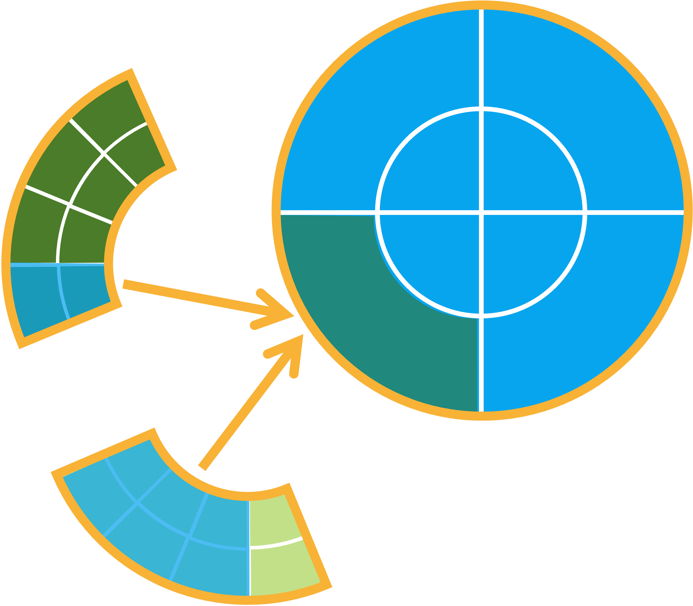
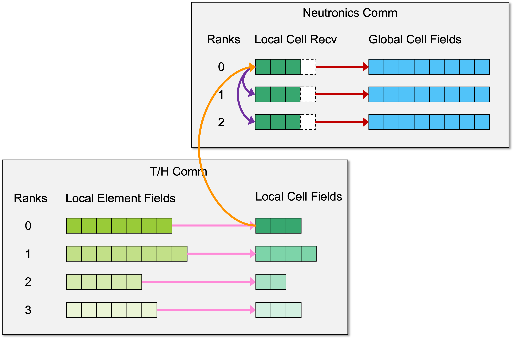
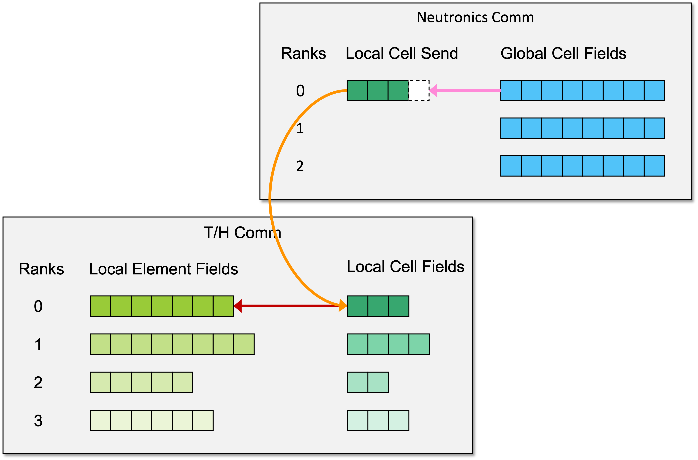

.. _methodology_cell_avg:

===============================
Cell-Averaged Solution Transfer
===============================

Conformity and Domain Decomposition
-----------------------------------

ENRICO expects that the neutronics and thermal/hydraulics (T/H) geometries are conformal.
A T/H element should be contained by only one neutronics cell.  On the other hand, a neutronics cell can
-- and typically does -- contain multiple T/H elements.  ENRICO does not raise a fatal error if the geometries
are non-conformal, but it does report quantitative errors in volume mappings to help the user assess conformity.

The full-fidelity T/H solvers (Nek5000 and NekRS) are domain-decomposed, and for maximum performance of the T/H solvers,
ENRICO allows any domain decomposition.  On the other hand, the neutronics solvers (OpenMC and Shift) are not domain
decomposed.  Hence, a neutronics cell can --- and often does --- span multiple T/H subdomains.  Accounting for this
is an important requirement of the cell-averaged solution transfer scheme.

:numref:`geom_conform_01` depicts neutronics and T/H geometries that meet the above-mentioned requirements.

.. _geom_conform_01:

    Simplified depiction of conformal neutronics and T/H geometries.  In the neutronics geometry (left), cells are
    depicted in blue. In the T/H geometry (right), elements are depicted in shades of green.  In both geometries,
    orange lines represent subdomains.  Note that the T/H geometry is domain decomposed and the neutronics geometry
    is not.

Communication Patterns for Solution Transfer
--------------------------------------------

Global and Local Cells
~~~~~~~~~~~~~~~~~~~~~~

When transferring cell-averaged and element-averaged field data, ENRICO must account for the general situataiton of one
neutronics cell spanning arbitrarily many T/H subdomains.  For illustrative purposes, :numref:`geom_conform_02` depicts
one neutronics cell spanning two T/H subdomains.

.. _geom_conform_02:

    Simplified depiction of one neutronics cell (blue overlay) spanning multiple T/H subdomains (orange lines).
    The T/H elements are shown in shades of green.

Let us consider possible ways to transfer element-averaged T/H data to cell-averaged neutronics data.

Option 1
    Each T/H rank sends its element-averaged data to a neutronics rank.  Then the neutronics rank computes
    cell-averaged data from the element-averaged data using a mapping of cells to elements.

Option 2
    First, each T/H rank averages its element-wise data over its local portion of each neutroincs cell. We denote a T/H
    rank's portion of a cell as a **local cell**, in contrast to a neutronic rank's **global cell**.  Averaging over
    local cells requires no message passing and can be done by each T/H rank independently.  Second, each T/H rank sends
    its local-cell-averaged data to a neutronics rank.  Finally, the neutronics rank computes the global-cell-averaged
    data from the local-cell-averaged data using a mapping of local cells to global cells.

Option 2 is a more desirable implementation for many reasons.  It resembles a commonly-implemented optimization of global
reduction, which involves a two-stage local and global reduction.  The local reduction (averaging over local cells
on each T/H rank) increases the amount of computation that is done in parallel.  Furthermore, the local reduction reduces
the message sizes in the final global reduction (accumulating local cells into global cells).  The pattern
is shown :numref:`geom_conform_03`

.. _geom_conform_03:

    This depicts how element-wise T/H data is reduced into one global neutronics cell.  First, each T/H sudomain
    (the two wedges containing green elements) separately averages its element-wise data into its local cell (the blue
    overlay).  This involves no communication.  Second, each T/H rank sends its local cell-averaged data to the
    neutronics rank (whose domain is represented by the blue circle).  In the real implementation, each T/H rank
    sends all its local cell data in a single message.  Finally, the neutronics rank averages the local
    cell data into its corresponding global cell (the green overlay).

Temperature and Density Updates
~~~~~~~~~~~~~~~~~~~~~~~~~~~~~~~

Updating the temperature and density involves sending data from the T/H communicator to the neutronics communicator.  The
communication pattern is illustrated :numref:`temp_density_update`

Step 1 (pink arrows)
    Each T/H rank averages its local-element data into its local cells.  This is done in parallel without
    any MPI communication.

Step 2 (orange arrow)
    One T/H rank sends its local-cell field to the neutronics root.  This currently a blocking, point-to-point send/receive.

Step 3 (purple arrows)
    The neutronics root broadcasts the local-cell field to the other neutronics ranks.  This is also blocking.

Step 4 (red arrows)
    Each neutronics rank begins accumulating the updated local-cell field into its global-cell field.  This is done
    in parallel without any MPI communication.

Step 5
    Repeat steps 2 through 4 for each remaining heat rank.

.. _temp_density_update:

    Communication pattern for temperature and density updates

Heat Source Update
~~~~~~~~~~~~~~~~~~

Updating the heat source involves sending data from the neutronics communicator to the T/H communicator.  The communication
pattern is illustrated in :numref:`heat_update`.

Step 1 (pink arrow)
    The neutronics root sets the local-cell field for one heat rank.

Step 2 (orange arrow)
    The neutronics root sends the local-cell field to the respective heat rank.  This is currently a blocking send/receive.

Step 3 (red arrow)
    The heat rank sets its local-element data from the updated local-cell field.  This requires no MPI communication.

Step  4
    Repeat steps 1 through 3 for each heat rank.

The neutronics root begins step 1 for T/H rank :math:`n+1` immediately
after it completes step 2 for T/H rank :math:`n`.  This means that steps 1 and 2 for T/H rank :math:`n+1` can begin
before step 3 is completed for T/H ranks :math:`\le n`.  This increases the amount of parallel computation.

.. _heat_update:

    Communication pattern for heat source update

