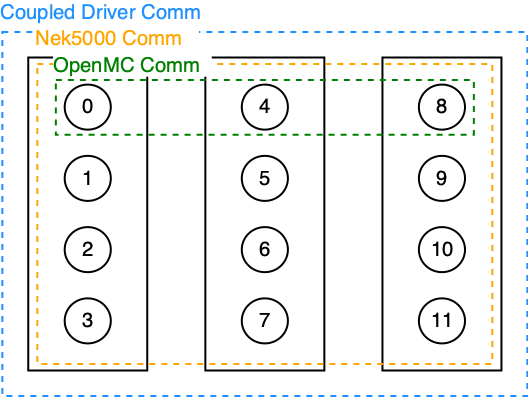

.. _methodology_comm_split:

======================
Communicator Splitting
======================

Constructing Split Comms
~~~~~~~~~~~~~~~~~~~~~~~~

The coupled Nek5000/OpenMC driver must account for the fact that the two single physics codes have
different parallelization schemes:

* Since OpenMC is a hybrid MPI/OpenMP code, its performance is best when each node is assigned 1
  or 2 MPI ranks and sufficient OpenMP threads to occupy all CPU cores [Romano2015]_.
* Since Nek5000 is a pure MPI code, its performance is best when each node is assigned sufficient
  MPI threads to occupy all CPU cores.

To handle this, ENRICO creates the MPI communicators shown in :numref:`openmc-nek-comms`.  Black
rectangles represent a physical node [#f1]_.  Black circles represent MPI ranks.  Numbers
represent MPI rank IDs; for our implementation, the actual numbering can be arbitrary.

* The OpenMC communicator (in green) encompasses 1 rank in every node, by default.  An alternate
  number of ranks per node can be specified.
* The Nek5000 communicator (in orange) encompasses all ranks in all nodes.  Currently, this is
  simply a duplicate of ``MPI_COMM_WORLD``.
* The coupling communicator (in blue) is the union of the OpenMC and Nek5000 communicators.  This is
  also a duplicate of ``MPI_COMM_WORLD``.

.. _openmc-nek-comms:

    Communicators used by ENRICO for coupled Nek5000/OpenMC simulations.

Message Passing Patterns
~~~~~~~~~~~~~~~~~~~~~~~~

Nek5000 and OpenMC also differ with respect to data decomposition:

* Nek5000 is domain-decomposed.  Hence, data fields (such as temperature) are distributed across
  among MPI ranks in the Nek5000 communicator.  For most of these fields (including temperature),
  there are no arrays that contain data for the entire domain.
* OpenMC is domain-replicated.  Hence, the data fields of interest (such as heat sources) are
  replicated on each MPI rank in the OpenMC communicator.

To transfer this data, ENRICO employs MPI gather and scatter routines.

:numref:`data_exchange_01` shows the general pattern for gathering distributed data from Nek5000
to OpenMC.

* In the Nek5000 ranks (bottom), each rank contains a data buffer for its local subdomain.
  The size of each buffer is equal to the number of local elements (``nelt``).  Because the size
  of each subdomain can differ, the size of each data buffer can likewise differ in a given rank.
* In the OpenMC ranks (top), there are receive buffers to gather data from Nek5000's subdomains.
  The size of each data buffer is equal to the number of global elements in Nek5000 (``nelg``)
  and is the same in each rank.

To gather Nek5000's data buffers into OpenMC's data buffers, the
`MPI_Gatherv <https://www.open-mpi.org/doc/v3.0/man3/MPI_Gatherv.3.php>`_ function is used.
This allows ENRICO to gather local buffers of various sizes [#f2]_.

.. _data_exchange_01:

.. figure:: img/coupling_scheme_01.png
    :height: 450px
    :align: center
    :figclass: align-center

    General pattern for gathering distributed data from Nek5000 to OpenMC

To scatter OpenMC's data buffers into Nek5000, the
`MPI_Scatterv <https://www.open-mpi.org/doc/v3.0/man3/MPI_Scatterv.3.php>`_ is used.  The MPI
standard ensures that, in a given run of the simulation, the Scatterv will respect the same
ordering of the Gatherv.

.. rubric:: Footnotes

.. [#f1] The nodes are inferred by the ``MPI_COMM_TYPE_SHARED`` option in the `MPI_Comm_split_type <https://www.open-mpi.org/doc/v3.0/man3/MPI_Comm_split_type.3 .php>`_ function.  Typically, this splits a communicator based on physical nodes, but the exact results may vary by MPI implementation.

.. [#f2] Though :numref:`data_exchange_01` shows a Gatherv operation for each OpenMC rank, the current version of ENRICO will call a single Gatherv on one OpenMC rank and then a single broadcast to the other MPI ranks.

.. rubric:: References

.. [Romano2015] Paul Romano, Andrew Siegel, Ronald Rahaman.  *Influence of the Memory Subsystem on
                Monte Carlo Code Performance*  ANS MC2015 -- Joint International Conference on
                Mathematics and Computation (M&C), Supercomputing in Nuclear Applications (SNA),
                and the Monte Carlo (MC) Method

